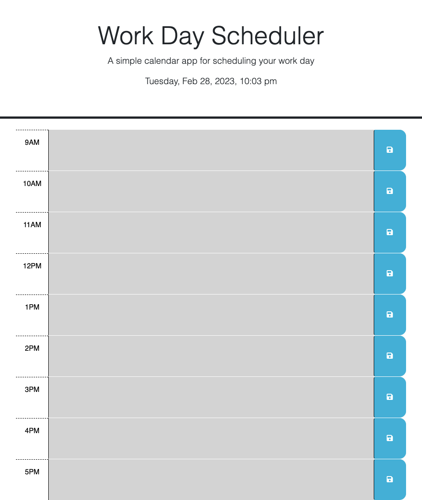

# daily-planner-module-5-challenge

## Description

My motivation for this project was to build a calendar application that saves events for each hour of the workday using jQuery to dynamically update the HTML and CSS.

## Installation

N/A

## Usage

Live URL: 

Screenshot: 

## Credits

N/A

## License

N/A